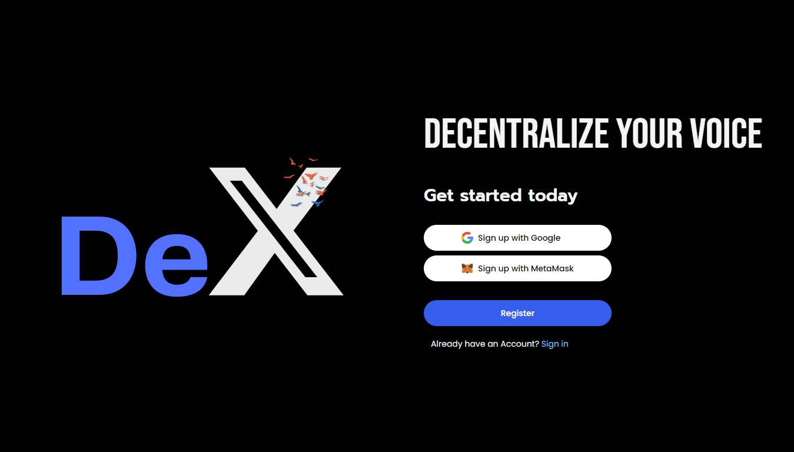
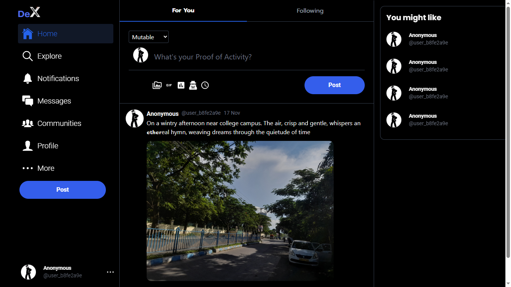
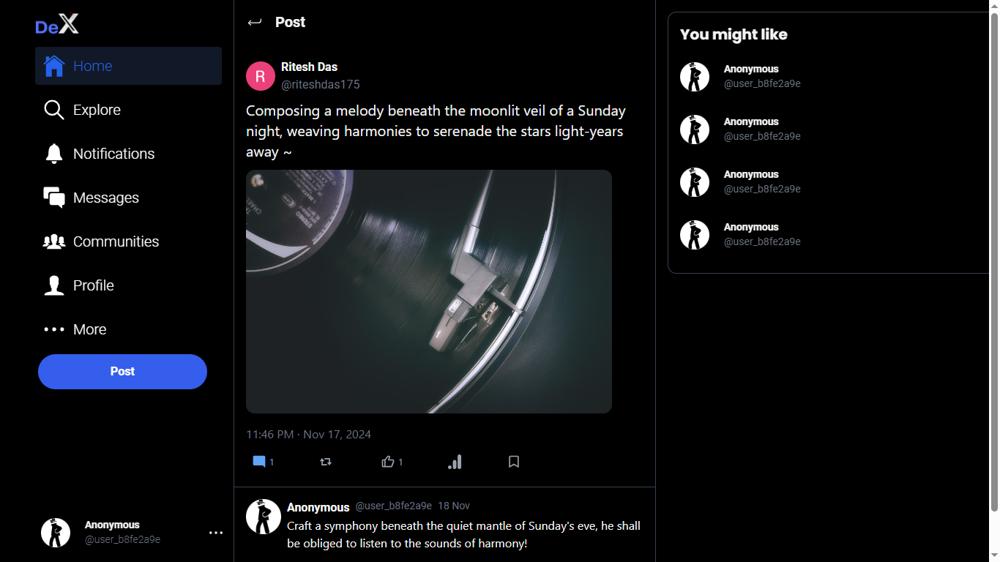
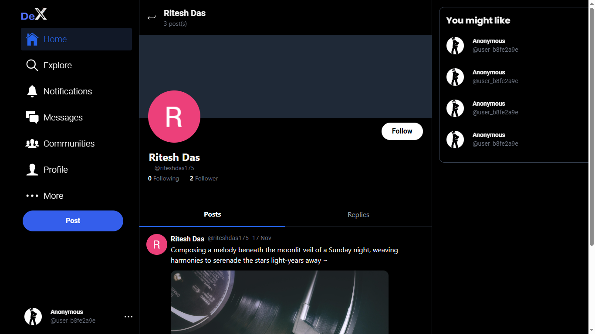

# Decentralized-Twitter

A re-imagined version of the traditional social media platform - Twitter, but it's decentralized. Built with blockchain technology ensuring transparency, user control and anonymity (pseudonymity) - here you control what you post using smart contracts on Ethereum, and every interaction is recorded securely on the blockchain.



Development is still under progress ⚠️

## Key Features:

Blockchain-Powered: Every tweet, like, or post is stored and verified using Ethereum smart contracts, so nobody can tamper with your data.

Anonymity First: Stay anonymous (pseudonymous) whenever you want to. No personal data is stored in this case except for the wallet address using which a UUID is generated. (Nature of Ethereum is pseudonymous because transactions and wallet address are publicly visible)

Your Data, Your Control: There are no central servers. Your posts are managed through smart contracts which means only you are in control of what you decide to post. Share images/videos through Pinata IPFS, with the IPFS hash (media CID) linked to your post on the blockchain.

Ethereum Wallet Login: Simply connect with your MetaMask wallet to go pseudonymous and continue to post, read, and engage with others. All interactions are between your wallet and the blockchain.

## dApp Screenshots








## Usage

Clone the repository if you haven't already

```
git clone https://github.com/Dyslex7c/Decentralized-Twitter
```

Install dependencies in both the directories, client and server

## Setting up the server

Firstly, launch the database using Docker

```
docker compose up dev-db -d
```

Make sure PostgreSQL database is running in the background

After that, set up Prisma

```
npx prisma generate
npx prisma studio
```

Finally, run the server

```
npm run start:dev
```

## Setting up the client

Spin up a local blockchain node with hardhat (optional if you want to deploy the contract on a testnet)

```
npx hardhat node
```

Deploy your contract

```
make deploy
```

Finally, run `npm start` and you're good to go.